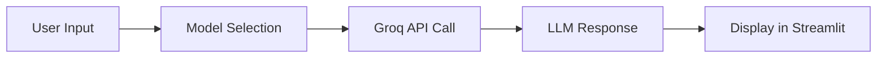
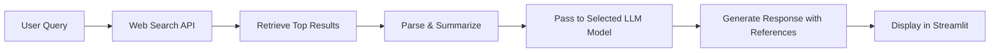
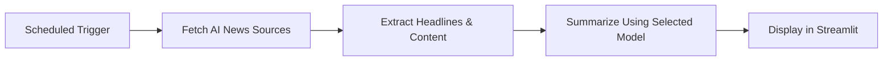
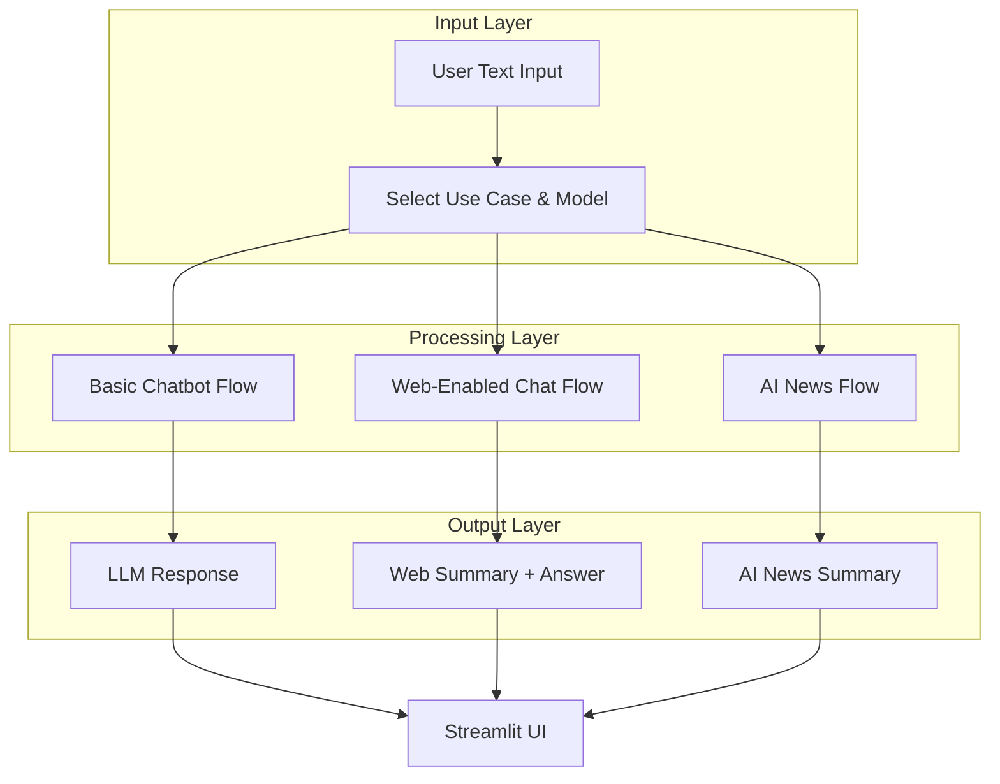

# Agentic AI Systems

## Overview
Agentic AI Systems is a multi-use-case AI chatbot framework built using **Streamlit**, **Groq API**, and Retrieval-Augmented Generation (RAG) techniques.  
It provides three main use cases:
1. **Basic Chatbot** – Direct interaction with selected LLM models.
2. **ChatBot With Web** – Web-integrated chatbot capable of retrieving and summarizing online information.
3. **AI News** – Automated AI-related news summarizer using live feeds and LLM-powered analysis.

---

## Tech Stack

- **Frontend:** [Streamlit](https://streamlit.io/)
- **LLM API Provider:** [Groq](https://groq.com/)  
- **Models Supported:**  
  - llama-3.3-70b-versatile  
  - gemma2-9b-It  
  - openai/gpt-oss-120b  
  - qwen/qwen3-32b  
- **RAG (Retrieval-Augmented Generation):**  
  - Document loaders (PDF, TXT, Web URLs)  
  - Embeddings generation  
  - Vector store for context retrieval  
- **Web Search:** DuckDuckGo Search API
- **News Retrieval:** RSS/News API
- **Backend Language:** Python 3.10+

---

## Use Cases & Workflows

### 1. Basic Chatbot
**Goal:** Provide a simple conversational interface using selected LLM models.

**Workflow:**


---

### 2. ChatBot With Web
**Goal:** Enable the chatbot to search the internet, retrieve results, and provide summaries with citations.

**Workflow:**


---

### 3. AI News
**Goal:** Automate retrieval and summarization of AI-related news.

**Workflow:**


---

## Pipeline Structure



---

## Installation & Setup

1. **Clone the Repository**
```bash
git clone https://github.com/bhanu1836/Agentic_Chatbots_RAGS.git
cd Agentic_Chatbots_RAGS
```

2. **Install Dependencies**
```bash
pip install -r requirements.txt
```

3. **Set Environment Variables**
Create a `.env` file and add your API keys:
```bash
GROQ_API_KEY=your_groq_api_key_here
```

4. **Run the App**
```bash
streamlit run app.py
```

---

## Folder Structure

```
Agentic_Chatbots_RAGS/
│
├── app.py                # Main Streamlit app
├── requirements.txt      # Dependencies
├── workflows/            # Use-case-specific logic
│   ├── basic_chatbot.py
│   ├── chatbot_with_web.py
│   └── ai_news.py
├── utils/                # Helper functions
└── README.md             # Documentation
```

---

## Future Improvements
- Voice input integration
- More advanced RAG pipelines
- Multi-modal inputs (images, PDFs, video frames)
- User authentication & personalization

---

## License
This project is licensed under the MIT License.
